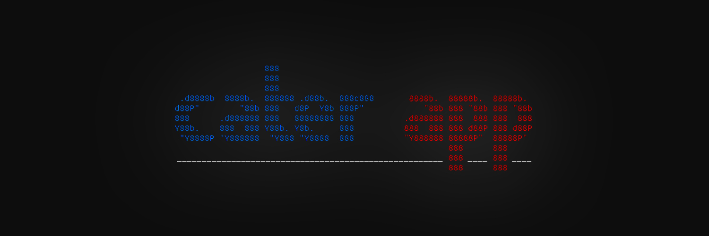
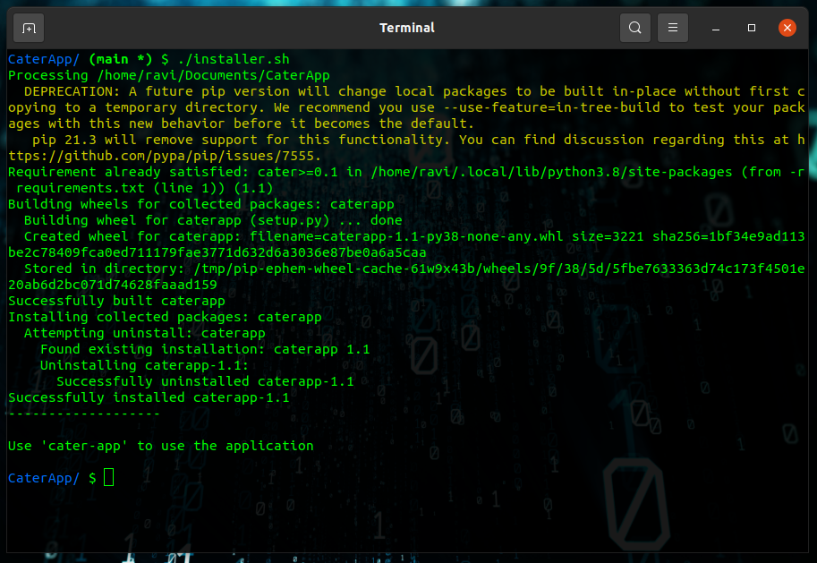

# **CaterApp - v1.1** (bate)   

<p align="center">
  <a href="#-description">Description</a>
  &nbsp;&nbsp;&nbsp;|&nbsp;&nbsp;&nbsp;
  <a href="#-installation">Installation</a>
  &nbsp;&nbsp;&nbsp;|&nbsp;&nbsp;&nbsp;
  <a href="#-usage">Usage</a>
  &nbsp;&nbsp;&nbsp;|&nbsp;&nbsp;&nbsp;
  <a href="#-contributing">Contributing</a>
</p>  



<!-- _A Quick & Secured Data Sharing Application!_ --> 


[](https://github.com/ravi-prakash1907/cater)
[](./LICENSE)
[](https://ravi-prakash1907.github.io/CaterApp)
[](https://twitter.com/73MP0R4L)
[](https://github.com/ravi-prakash1907/CaterApp/releases)

## ✉️ Description
CaterApp is a cross platform, remotely data sharing tool created for sharing files in a quick and secured manner. It is aimed to integrate this tool with several more features including providing a User Interface.\
The _version 1.1_ of the CaterApp currently works with **command line interface** i.e. **CLI**.

### 💥 What's so exciting ?  
CaterApp comes with a range of fantastic features for you:  
1. Share **any** type of file, including large videos and compressed documents.  
2. You can choose as much files as you want.  
3. Keeps you updated with the files, i.e. being shared in real time.  
4. Also, it displays the size of files (in bytes).  
5. Tells the **speed** at which the data got delivered and a lot more...

## 📌 Installation  
This is a `python` application and especially dependent on the [**cater**](https://github.com/ravi-prakash1907/cater) module of the same.  
It can be installed :

### ❓ Requirements  
1. Any Linux system or installed bash / zsh terminal (preferred)  
2. Python 3.2 or higher version  
3. pip (latest recommended)  

### ➡ Steps to Install
Installation can be done through CLI in just a few of the simple steps:  

1. Either clone this repository or simply download the CaterApp-v1.1 here \([tar](https://github.com/ravi-prakash1907/CaterApp/archive/refs/tags/v1.1.tar.gz), [zip](https://github.com/ravi-prakash1907/CaterApp/archive/refs/tags/v1.1.zip)\)  
2. Extract the compressed file (if you have cloned/downloaded) and navigate into **CaterApp** directory  
3. Execute the `installer.sh` to install the application through following terminal command:  
```sh
$ ./installer.sh
```
After successful installation, you should see something like this:  
  

## 🤔 Usage  
Once you have installed the application on your system, you can simply access CaterApp tool with a single command as follows: 
```sh
$ cater-app
```
As an alternative, you can also follow the following:  
```sh
$ cd ~/CaterApp/caterapp
$ python cater.py
```

## 🤝 Contributing  
If you wish to contribute in this project, you can always **fork** this repo and generate a pull request with new changes. You may also raise issues, if any.  

🌟 Happy sharing!!! 🌟

---  
_Developed by [ravi](http://ravi-prakash1907.gitlab.io/) in 🐍 with ❤️_
